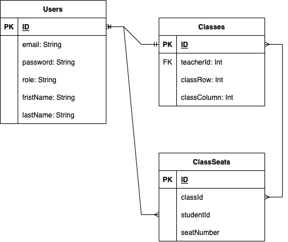
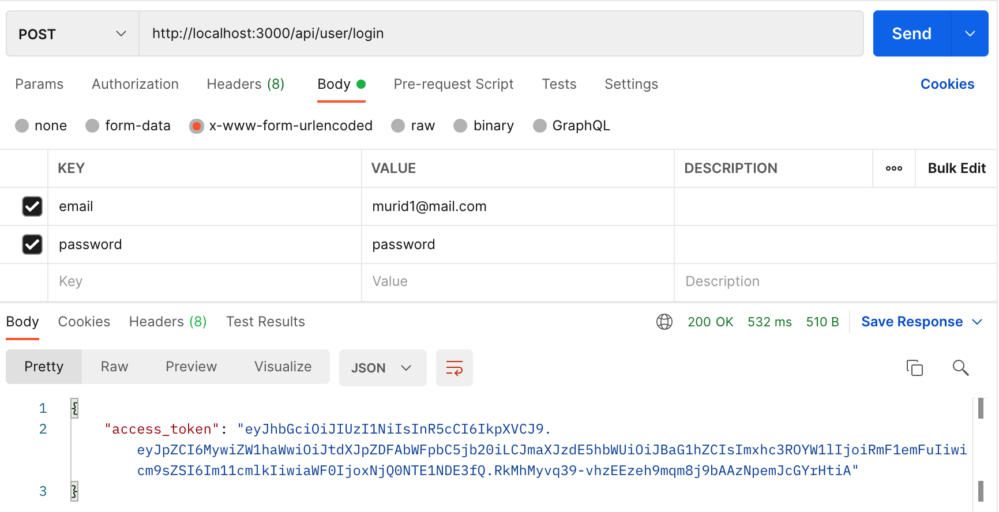
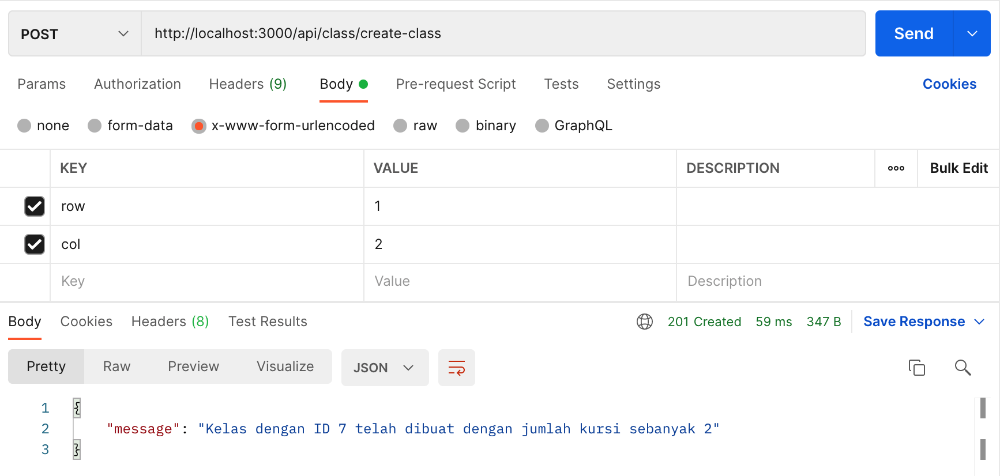
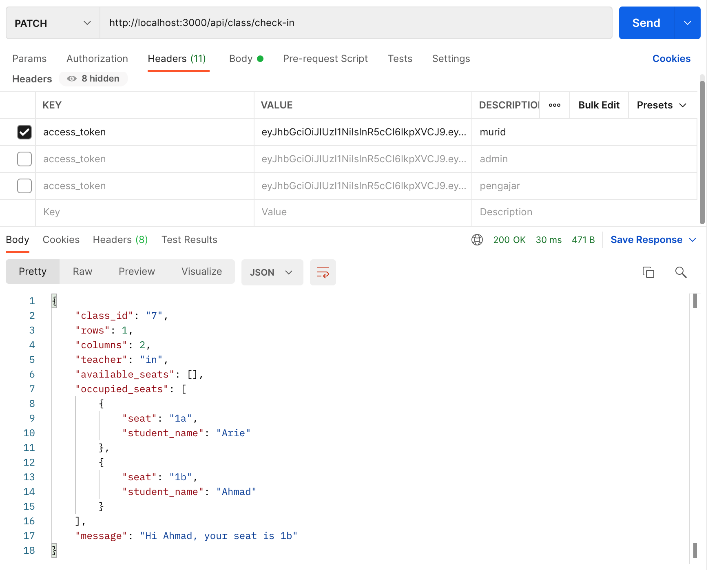
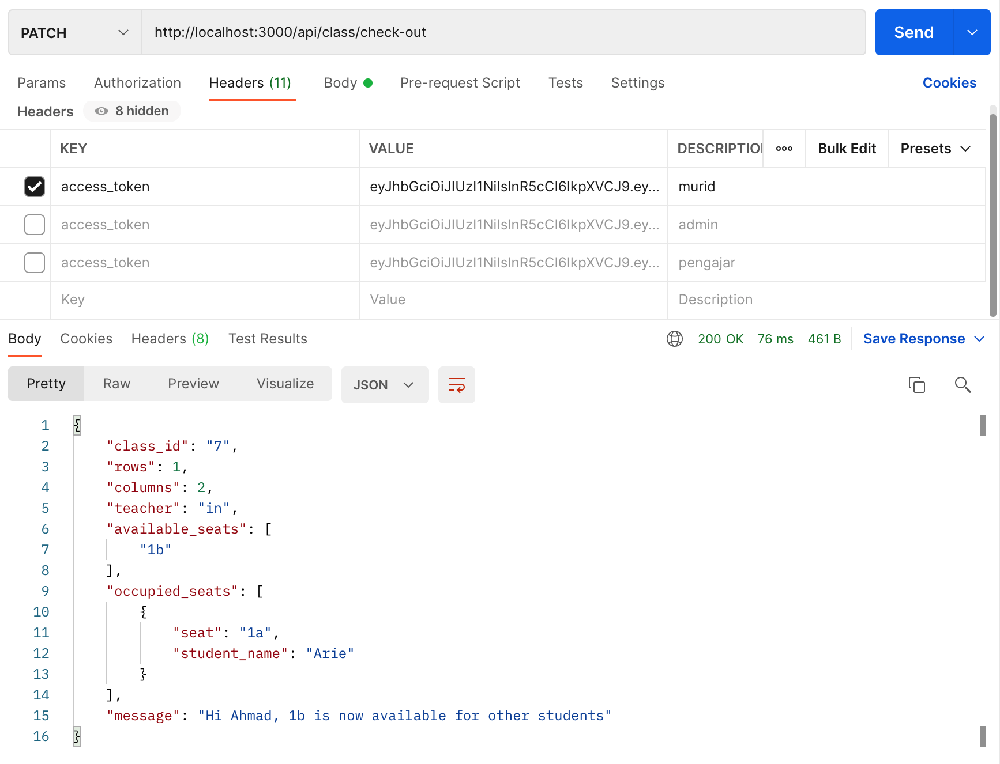

# Kelas Siswa Backend

## Deskripsi
Aplikasi ini adalah aplikasi backend yang dibuat menggunakan NodeJS, Express, PostgreSQL, Sequelize, untuk proses pemodelan belajar mengajar dalam kelas yang di dalam nya terdapat 1 orang guru / pengajar dan murid.

## Skema Database


## Instalasi
- Aplikasi ini menggunakan NodeJS dan Node Package Manager (NPM), untuk proses instalasi, lakukan pengetikan kode `npm i` pada terminal.
- Pastikan di local anda menggunakan `database PostgreSQL`, atau jika belum Anda dapat menginstallnya pada tautan berikut 
[URL](https://www.postgresql.org).
- Setelah dipastikan Anda memiliki DB PostgreSQL, ganti `database user development` pada folder `config -> config.json` sesuai dengan kredensial yang sudah Anda install di lokal Anda, lalu lakukan :
```bash
  npx sequelize-cli db:create
  npm run db:dev
  npm run dev
````
- Saya sudah membuat `seeder user` agar proses testing lebih cepat, berikut list akun user yang dapat digunakan untuk login dan mendapatkan token: 
```json
{
  email: 'admin@mail.com',
  password: password
},
{
  email: 'pengajar@mail.com',
  password: password
},
{
  email: 'murid1@mail.com',
  password: password
},
{
  email: murid2@mail.com,
  password: password
},
{
  email: murid3@mail.com,
  password: password
}
```
- API endpoint yang saya gunakan untuk aplikasi ini ada di [API Docs](https://documenter.getpostman.com/view/8074442/UVeMGhwX)

## Hasil
Berikut beberapa hasil yang sudah saya develop dan test di local saya : 

- Login & Access Token

- Membuat Kelas

- Fitur Check In berdasarkan Access Token

- Fitur Check Out Berdasarkan Access Token


## Asumsi
Beberapa asumsi yang saya tambahkan ketika proses development adalah :
- Kamus huruf alphabeth untuk pembuatan column kelas, maksimal column yang saya tetapkan untuk pembuatan kelas adalah 27, sebagaimana banyaknya alphabeth yaitu 27.
- Menambahkan pesan ketika pembuatan kelas berhasil dibuat
- Menambahkan pesan ketika pengajar melakukan check in dan check out
